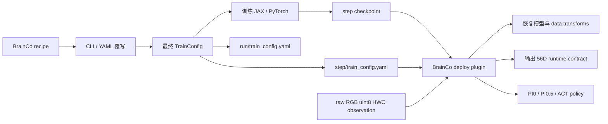

# refactor(brainco): 以 checkpoint 自描述配置重构训练部署握手

> Source: `0712_new_structure`
> Target: `main`
> 当前状态：**已在本地 `main` 完成合并并通过代码验证，待 push**

## 背景

现有 BrainCo-IL 训练和部署流程依赖 Python `_CONFIGS` 中的配置名：训练侧每次实验通常新增一个 `TrainConfig`，部署侧再通过 `policy_id` 回到训练仓库查找同名配置。这样会导致 checkpoint、训练代码和部署代码必须保持版本一致；一旦配置被重命名、删除或两端代码版本不一致，就可能无法复现实验，甚至加载到错误的模型结构或数据变换。

本 MR 将训练和部署的真相源改为 checkpoint 内的 `train_config.yaml`：训练时保存完整展开后的 `TrainConfig`，部署插件从 checkpoint 恢复模型、数据 transform 和运行时契约，不再依赖 `_CONFIGS` 中的实验名。

## 分支状态

- 共同祖先：`9e39492` (`feat(data): add fast BrainCo norm stats script`)
- `0712_new_structure` 独有：5 个提交
- `main` 独有：1 个提交 `941ab00` (`feat(brainco): add Revo3 56D training configs`)
- 合并前三点差异：9 个文件，`+750 / -690`
- 合并时 `src/openpi/training/config.py` 的唯一文本冲突已按新架构解决；`main` 的最终 checkpoint 开关和三个 Revo3 配置均已保留。

## 核心改动

### 1. checkpoint 自描述配置

新增 `src/openpi/training/config_io.py`，提供：

- `save_train_config()`：将完整 dataclass 配置序列化为 `train_config.yaml`；
- `load_train_config()`：按 `schema_version` 校验并恢复 `TrainConfig`；
- `find_train_config_yaml()`：支持从 run 根目录、step checkpoint 或显式 YAML 路径查找配置；
- 仅允许恢复 `openpi.*` 下的 dataclass，避免加载任意外部 Python 类；
- 当前 schema 版本为 `1`。

配置保存位置：

```text
<checkpoint_base_dir>/<config_name>/<exp_name>/train_config.yaml
<checkpoint_base_dir>/<config_name>/<exp_name>/<step>/train_config.yaml
```

这样即使只复制单个 step checkpoint，部署端仍能恢复训练时的模型、数据集 transform、action horizon 和超参数语义。

### 2. JAX / PyTorch 训练入口接入配置保存

`scripts/train.py`：

- run 目录初始化后保存一次完整配置；
- 每次 step checkpoint 异步写入完成后，再向该 step 目录写入配置；
- 使用 `effective_freeze_filter` 统一处理可序列化冻结策略。

`scripts/train_pytorch.py`：

- 新训练 run 创建时保存根目录配置；
- checkpoint 原子重命名完成后保存 step 配置；
- 仅主进程写 run 根目录配置，避免 DDP 多进程竞争。

训练入口新增 YAML 直读方式：

```bash
python scripts/train.py /path/to/train_config.yaml
```

原有 recipe + CLI 覆写方式仍保留：

```bash
python scripts/train.py pi05_brainco_56d \
  --exp-name revotron_0712_pi05_chunk16 \
  --model.action-horizon 16 \
  --batch-size 16
```

### 3. 训练配置收敛为稳定 recipe

`_CONFIGS` 从 `main` 的 33 个配置收敛到 6 个：

- `pi05_brainco_56d`
- `act_brainco_56d`
- `debug`
- `debug_restore`
- `debug_pi05`
- `debug_act`

其中前两个是可覆写的 BrainCo 56D 基准 recipe。新实验原则上通过 CLI 或 YAML 覆写 dataset、chunk size、batch size、step、学习率等字段，不再持续向 Python `_CONFIGS` 添加实验专用配置。

本分支相对 `main` 删除的配置如下：

<details>
<summary>展开查看 28 个被移除的配置名</summary>

- BrainCo / Revo3：
  - `act_brainco_revo3_0708_chunk16`
  - `act_brainco_revo3_0712_ght_56d`
  - `act_brainco_revo3_pick_place_56d`
  - `pi05_brainco_multi_56d`
  - `pi05_brainco_revo3_0708_full_chunk16`
  - `pi05_brainco_revo3_0708_lora_chunk16`
  - `pi05_brainco_revo3_0712_ght_56d`
  - `pi05_brainco_revo3_pick_place_56d`
  - `pi05_brainco_revo3_pick_place_56d_full_chunk16`
  - `pi05_brainco_revo3_pick_place_56d_lora_chunk16`
- Aloha：
  - `pi0_aloha`
  - `pi05_aloha`
  - `pi0_aloha_pen_uncap`
  - `pi05_aloha_pen_uncap`
  - `pi0_aloha_sim`
  - `pi0_aloha_towel`
  - `pi0_aloha_tupperware`
- DROID：
  - `pi0_droid`
  - `pi05_droid`
  - `pi05_droid_finetune`
  - `pi05_full_droid_finetune`
  - `pi0_fast_droid`
  - `pi0_fast_full_droid_finetune`
- Libero：
  - `pi0_libero`
  - `pi05_libero`
  - `pi0_libero_low_mem_finetune`
  - `pi0_fast_libero`
  - `pi0_fast_libero_low_mem_finetune`

此外，RoboArena 与 PolaRiS 的动态 config 注册也从 `_CONFIGS` 移除。

</details>

相关 DataConfig 和 transform 类仍保留，当前 MR 只收敛可选训练 recipe，不做大范围基础实现删除。

### 4. 可序列化参数冻结策略

新增 `freeze_strategy`，解决旧 `freeze_filter` 对象无法可靠写入 YAML 的问题：

- `none`：沿用 legacy `freeze_filter`；
- `lora_and_action_interface`：仅训练 LoRA、action input/output projection 和 time MLP；
- `action_interface_only`：冻结 VLM，仅训练 action interface 和 time MLP。

同时增加配置校验：

- `freeze_strategy` 与 legacy `freeze_filter` 不允许同时设置；
- LoRA 策略必须使用至少一个 LoRA model variant；
- action-interface-only 策略要求使用非 LoRA variant。

### 5. 部署插件改为 checkpoint 驱动

`src/openpi/deploy/plugin.py` 的接口从：

```python
describe_policy(checkpoint_dir, policy_id=...)
create_policy(checkpoint_dir, policy_id=...)
```

调整为：

```python
describe_policy(checkpoint_dir, runtime_options=None, overrides=None)
create_policy(checkpoint_dir, runtime_options=None)
```

主要行为变化：

- 不再通过 `policy_id` 查询 `_CONFIGS`，直接读取 checkpoint 的 `train_config.yaml`；
- spec 使用 `config_name` 和实际 `model_type`，支持 PI0、PI0.5 与 ACT；
- `num_inference_steps` 只对 PI0 / PI0.5 生效，ACT 不接收扩散采样参数；
- action 输出仍固定为 BrainCo 56D absolute joint position，并显式描述双臂、双手的 index 范围；
- observation 图像契约改为 raw RGB `uint8` HWC，由 plugin 负责 resize 和后续预处理；
- 对缺失图像、float/CHW 等旧格式输入 fail fast。

### 6. 文档、测试和本地运行产物

- 新增训练部署握手文档 `docs/vla_trainning_deploy_handshake.md`；
- 新增 raw image contract 单测；
- 新增冻结策略 YAML round-trip 和参数过滤单测；
- `.gitignore` 新增 `logs/`、`swanlog/`、`*.pid`。

## 新流程



## 对外接口与兼容性变化

| 项目 | 旧行为 | 新行为 | 影响 |
|---|---|---|---|
| 部署配置来源 | `policy_id` + `_CONFIGS` | checkpoint `train_config.yaml` | deploy 调用方必须同步升级 |
| 旧 checkpoint | 可依赖仓库内同名 config | 缺少 YAML 时无法加载 | 需要补齐 YAML 或保留迁移工具 |
| 图像输入 | 默认按预处理后的 CHW/float 理解 | raw RGB uint8 HWC | observation 生产端必须调整 |
| 模型类型 | plugin 固定声明 PI0.5 | 从 checkpoint 恢复 PI0 / PI0.5 / ACT | ACT 不再收到 `num_steps` |
| 训练配置 | 每个实验一个 Python config | 2 个 recipe + CLI/YAML | 旧训练命令中的 config 名将失效 |
| 单 step 部署 | 依赖外部 config 名 | step 自带 YAML | checkpoint 可独立迁移 |

## 提交列表

1. `9ecef52` — `Refactor BrainCo training deploy config flow`
   - 引入 YAML config IO；
   - 收敛训练 recipe；
   - 训练入口保存配置；
   - plugin 改为 checkpoint 驱动。
2. `19df842` — `Fix checkpoint config save ordering`
   - 等待 checkpoint 异步保存完成后再写 step 配置；
   - 忽略本地训练日志和 pid 文件。
3. `648b997` — `Document BrainCo training deploy handshake`
   - 补充训练、checkpoint、plugin 和 revo_deploy 的责任边界与使用说明。
4. `15cf8ec` — `Define raw observation plugin contract`
   - 明确 raw RGB uint8 HWC 输入契约；
   - 增加 fail-fast 校验及单测。
5. `5b53111` — `Add serializable BrainCo freeze strategies`
   - 增加 LoRA / action-interface 可序列化冻结策略及测试。

## 验证结果

已执行：

```bash
PYTEST_DISABLE_PLUGIN_AUTOLOAD=1 uv run pytest -q \
  src/openpi/training/config_test.py \
  src/openpi/deploy/plugin_test.py
```

结果：`6 passed`。

已执行：

```bash
PYTEST_DISABLE_PLUGIN_AUTOLOAD=1 uv run pytest -q scripts/train_test.py
```

结果：`1 passed`。该 smoke test 完整覆盖首次训练、最终 checkpoint 保存和恢复训练，耗时约 67 秒；存在现有依赖的 deprecation warning，但无测试失败。

另已手动验证 `pi05_brainco_56d` 与 `act_brainco_56d` 均可完成：

```text
TrainConfig -> train_config.yaml -> TrainConfig
```

并能恢复正确的模型类型、56D action dimension 和 action horizon。

首轮 pytest 会被系统 ROS Humble 的 `launch_testing` 插件污染，并因 Python 3.11 环境缺少 `lark` 在测试收集前退出；禁用第三方 pytest 插件后项目用例正常通过。

训练 smoke test 还发现旧的 JAX 持久编译缓存会导致原分支和合并结果在恢复训练时触发 native heap corruption；保留旧缓存并生成全新缓存后测试稳定通过，因此该问题不属于本次 merge 回归。

静态检查：

```bash
uv run ruff check \
  scripts/train.py scripts/train_pytorch.py \
  src/openpi/deploy/plugin.py \
  src/openpi/deploy/plugin_test.py \
  src/openpi/training/config.py \
  src/openpi/training/config_io.py \
  src/openpi/training/config_test.py
```

结果：**通过**，无 Ruff 错误。

## 合并处理结果

- [x] 从最新 `origin/main` 创建规范本地 `main`，并解决 `src/openpi/training/config.py` 的文本冲突。
- [x] 在 `scripts/train.py` 中同时保留 `save_final_checkpoint` 和 step `train_config.yaml` 保存顺序。
- [x] 将 `act_brainco_revo3_0708_chunk16`、`act_brainco_revo3_0712_ght_56d`、`pi05_brainco_revo3_0712_ght_56d` 转换为 `examples/brainco/config/train/` 下的完整 YAML。
- [x] 按新架构删除其余实验专用 config 和 RoboArena / PolaRiS 动态注册，只保留 2 个 BrainCo recipe + 4 个 debug recipe。
- [x] 修复 Ruff `PLC0415` 并重新执行静态检查。
- [x] `revo_deploy` 已由使用方确认完全适配无 `policy_id` plugin 接口与 raw HWC image contract。
- [ ] 给没有 `train_config.yaml` 的历史 checkpoint 明确迁移方案；至少验证一个历史 PI0.5 checkpoint 和一个新 ACT checkpoint。
- [ ] 建议将文档文件名中的 `trainning` 更正为 `training`，避免后续链接长期沿用拼写错误。

## 风险说明

1. **配置删除属于破坏性变更。** 依赖旧 config name 的训练脚本、文档和自动化任务需要迁移到 recipe + CLI/YAML。
2. **部署接口属于破坏性变更。** 旧 checkpoint 缺少 YAML 时会报 `FileNotFoundError`；本次合并不保留旧 `policy_id` fallback。
3. **图像契约发生变化。** 上游必须提供 RGB uint8 HWC 原图；旧 float CHW 输入会被明确拒绝。
4. **“完整配置”目前依赖受支持字段。** serializer 会跳过无法编码的对象，legacy `freeze_filter` 不会写入 YAML；新 BrainCo recipe 应使用 `freeze_strategy`，其他自定义 config 需要补充 round-trip 覆盖。
5. **尚未做真实 checkpoint/机器人验证。** 当前验证覆盖静态检查、单测、三个 Revo3 YAML、deploy contract 和 debug 训练恢复 smoke test，不代表真实 checkpoint、norm stats 和 action chunk 播放已经联调通过。

## 建议验收项

- [ ] PI0.5 全参数训练：run 与 step 目录均生成可加载的 `train_config.yaml`。
- [ ] PI0.5 LoRA 训练：恢复后 trainable/frozen 参数集合与训练时一致。
- [x] ACT YAML：plugin contract 不包含 `num_steps`，并声明正确的 56D action horizon。
- [ ] 从单独复制的 step 目录创建 policy，不依赖 `_CONFIGS` 或 `policy_id`。
- [ ] raw RGB uint8 HWC 三路相机输入正常，CHW/float/缺图输入明确报错。
- [ ] 历史 checkpoint 迁移后可以加载，或给出清晰的不兼容提示。
- [x] `main` 的三个 Revo3 配置均有可加载 YAML，`save_final_checkpoint` 也能完成 YAML round-trip。
